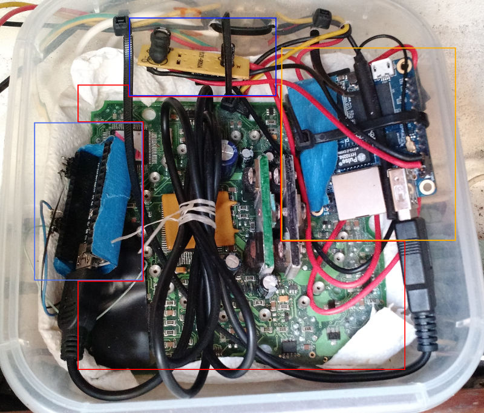

# seatalk4
another seatalk nmea multiplexer arduino base

It is implementation of multiplexer for seatalk <=> nmea and additional commands.
It runs on nano or uno (small amount of ram) and as a bi-directional voltage buffer I use old autopilot :)
Additional librarys:
Alt9SoftSerial for receiving 
SoftwareSerial9 for transmiting

it translate command from seatalk to nmea
0x00 - depth
0x30 - lamp
0x52 - sog
0x53 - cog
0x56 - RMC date from gps
0x58 - lat and lon
0x84 - compass heading, autopilot status, rudder 
0x9c - heading (flux)
allso it's a wind instrument :) as A0 wind direction, wind speed TODO

it translate
$xxRMB to seatalk
$00UNO,x 
x[
  ? - help
  q - wind sensor burst for testing
  a - autopilot auto
  s - autopilot standby
  t - autopilot track mode
  d - autopilot key press display
  w - autopilot vind wane mode
  + - +1 
  - - -1
  l[0-3] - lamp
]
$STUNO,0xaa,0xbb,, (send command as it is to seatalk)

:)

Hardware: 
My setup from scraps :)
old autohelp 5000+ as a voltage level buffer uart 5v on arduino seatalk ~13v
arduino nano connected to IC on autohelm 5000+ to get data in UART console
  9bit read/write to seatalk bus
orangepizero main brain of operation running armbian on it mqtt broaker, kplex, 
  tcp_toFrom_mqtt, http server
power supply usb car charger
aditional capacitors :P

